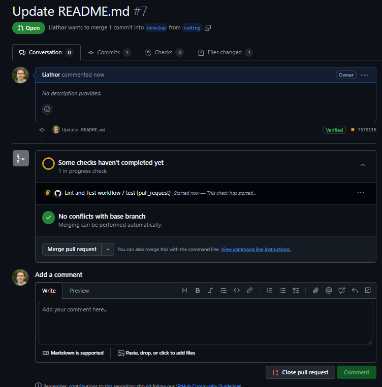
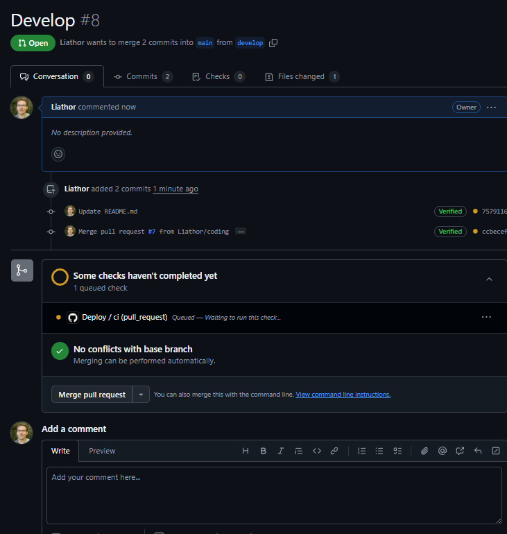

# GITHUB ACTIONs CI/CD SETUP

## Description
This is an example of Github Actions setup and running on a simple quiz app.

## Table Of Contents
1. [Installation](#installation)
2. [Usage](#usage)
3. [License](#license)
4. [Contribution Guidelines](#contribution)
5. [Tests](#tests)
6. [Questions](#questions)

## Installation
Download the files and run 'npm install' to install the required dependencies. Also make sure you update the .env file to allow for the database to be properly linked. You will also want to either fork or create a new GitHub repo in order to see the actions at work.

## Usage
Create two branches in your repo, one called 'develop' and one called anything other than 'develop' or 'main'.  

You can see the first Github action take place when you push a commit to the third branch, and then create a pull request from that branch to the develop branch.
  

You can see the second Github action take place when you make a pull request to merge the develop branch into the main branch.
  

## License
Distributed under the MIT. Visit [MIT](https://opensource.org/licenses/MIT) for more information.

## Contribution Guidelines
None

## Tests
None

## Questions
Feel free to reach out to me if you have any questions, or if you'd like to find out what else I've worked on. My details are as follows:  
  Github: https://github.com/Liathor  
  Email: dyermisha@gmail.com  
